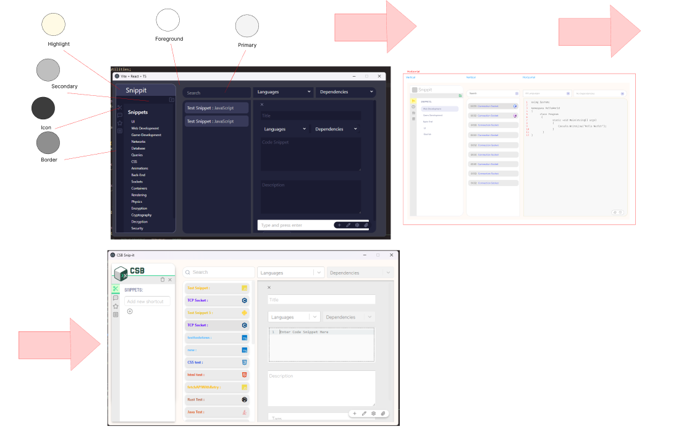

  

<h1 align="center">CSB-Snip-it</h1>

---

## ⚠️ Early Release Notice  

This is an **early release** of CSB-Snip-it. While the core functionality is complete, additional and more rigorous **runtime testing, optimizations, and bug fixes** will be carried out over the next **3 weeks**.  

Users may encounter unexpected behavior during this phase. Feedback and issue reports are welcome to help improve stability before the final stable release.  

---

---

This is a **release-only repository**, containing:  
- A documentation README (covering stack, architecture, design, and development logs)  
- The packaged application installer (available in the [Releases](https://github.com/LASR-0/CSB-Snip-it/releases) section)  

A desktop application built with Electron and React that helps manage and organize code snippets efficiently.  

[📥 Download Latest Release](https://github.com/LASR-0/CSB-Snip-it/releases)  

---

## 📖 Overview  

- **Goal:** My goal for this project was to develop an application that *I myself would use*. Some might say, *“doesn’t your text editor already let you store snippets?”* — which is true, but I also wanted to:  
  - Learn Electron with React for desktop apps  
  - Work with a backend language I hadn’t used before  
  - Explore IPC (inter-process communication) between TypeScript and JavaScript  
  - Finish the project in 2–4 months while improving my coding skills  

To keep myself accountable, I set some rules: (surrounding use of AI as a tool)  

**Ruleset**  
1. **0 copy-pasting code**  
   - Copying by hand forces me to *read* and *understand* the code, instead of blindly pasting.  

2. **Explanations required**  
   - Every time AI assisted, I required a summary of *why* certain design choices were being made. This helped me catch flawed architectural decisions early.  

3. **Meaningful variable naming**  
   - For every variable written (in AI generated examples or methods), I renamed it to something descriptive. This avoided ambiguous naming and made the codebase easier to understand.  

---

## 🧠 Thought Process  

I first broke down the stack:  

- **Framework:** Electron + React (to hit my learning goal)  
- **Backend:** TypeScript (to work with a new language)  
- **Database:** SQLite (`.db` file) for persistence — familiar to me and lightweight enough for this project  
- **Packaging:** Electron-builder (for cross-platform distribution on Windows/Linux/macOS)  

### Project Research  

I identified what I would code myself vs. what I’d take from npm libraries.  

**What I coded:**  
- Search functionality  
- Data classes and methods (no query builders)  
- Icon/language rendering (mapping “C#” → `csharp` icon, etc.)  
- Autocomplete search predictions  
- Filtering and state management  
- DB ↔ State syncing  
- Some custom CSS  

**What I used libraries for:**  
- `codemirror` → syntax highlighting / code editor  
- `react-select` → better select inputs  
- `react-tag-input` → tagging system  
- `tailwindcss` → speed up styling  

---

## 📚 Libraries & Tools  

- **CodeMirror:** Lightweight, widely used (even in Chrome dev tools)  
- **React-Select:** Saved time vs. writing custom dropdowns  
- **SQLite:** Familiar, easy to query, reliable for local storage  
- **Tailwind CSS:** Fast utility-first styling, mixed with some custom CSS for unique components  
- **Electron-Builder:** The obvious choice for distributing to Windows/Linux/macOS  

---

## 🗄 Database Design  

The database was designed with **three tables**:  

- **Snippets** → Stores all snippet objects  
- **Shortcuts** → Fixed 4 entries, one for each tab (string arrays)  
- **Language_Dependencies** → Maps supported CodeMirror languages + user-added dependencies  

This design keeps things simple and separates the three object types clearly.  

**Challenge:**  
Importing databases was risky since there was no schema validation. If a mismatched database was imported, some fields could lock or behave unexpectedly (though the app wouldn’t crash).  

**Future Fix:**  
Schema validation (already written using Zod, just not shipped in the initial release).  

---

## ⚙️ Tech Stack  

- **Frontend:** React, Tailwind CSS  
- **Backend:** Electron APIs, Node.js, TypeScript  
- **Database:** SQLite  
- **Build Tools:** Vite, Electron-Builder  

---

## 📌 User Stories (MoSCoW Method)  

**Must Have**  
- Create, edit, delete, and search snippets  
- Folder-like functionality for snippet organization  
- Import/restore databases  
- Syntax highlighting per language  
- View snippet metadata  

**Should Have**  
- Dark theme support  

**Could Have**  
(there wasn't much room for could haves) 

**Won’t Have (for now)**  
- Multi-user collaboration  
- Mobile support  
- Cloud sync  
- Encryption, login, registration  

---

## 🎨 UI/UX Design Journey  

Originally, the app was going to be *dark-only*. But I decided against it to prioritize **user experience** — so I implemented both light and dark themes.  

The design process was free-flowing, driven by experimentation and inspiration from browsing UI ideas on Pinterest. altough all elements had some kind of development/proto-typing in figma,
the only single component that didn't have a figma proto-type first is the settings slider.

  

  

---

## 🛠 Development  

Challenges and solutions I encountered during development:  

- **State management issues:**  
  - *Challenge:* Editor form didn’t reset properly when switching snippets.  
  - *Solution:* Reset local state on prop changes so the editor always reflected the correct snippet.  

- **Electron quirks:**  
  - *Challenge:* Database backup/replacement sometimes wrote `.json` files instead of `.db`.  
  - *Solution:* Standardized backups with `.db` extension, always saving under `app.getPath("userData")`.  

- **Database handling:**  
  - *Challenge:* JSON was too fragile for persistence; importing could break things.  
  - *Solution:* Migrated to SQLite, defined a schema, added error handling for imports.  

- **Cross-platform testing:**  
  - *Challenge:* File paths and packaging worked differently on macOS/Linux.  
  - *Solution:* Used Electron APIs for file paths, tested builds with electron-builder.  

---

## 📦 Release  

- **Packaging:**  
  Used **electron-builder**. Initial build size was ~500MB due to unnecessary files; trimmed dev-only assets down to ~100–130MB.  

- **Testing:**  
  - Installed on a clean Windows environment  
  - Verified shortcuts + database persistence  
  - Tested import/export workflows  
  - Confirmed the app launched correctly without reinstalling  

- **Publishing:**  
  Created a **public repo** for distribution (README, screenshots, installers). The private repo holds the source. Releases are published via GitHub Releases.  

    
    

  

---

## 🔮 Future Improvements  

- Reduce installer size further (~110MB target)  
- Zod schema validation for database imports  
- Note-taking feature  
- Additional themes  
- Full keyboard-only usability  

---

## 🙏 Closing Notes  

This project has been one of my biggest learning experiences so far. Along the way, I’ve gained practical skills in:  

- **TypeScript:** Strong typing for safer refactoring  
- **Electron:** Main/renderer communication, packaging apps  
- **IPC:** Secure channels between frontend/backend  
- **React State Management:** Keeping complex form state consistent  
- **Database Handling:** Migrating from JSON → SQLite with import/export support  
- **Vite:** Faster hot reloads and bundling  
- **UI/UX Iteration:** From barebones to polished, user-oriented design  

Overall, this project helped me understand react alittle more deeply, aswell as showing me the ropes of electron, i covered topics i haven't touched on before, such as importing database files and updating the runtime state, aswell as themeing. i hope to learn even more in the upkeep of the app, im excited to do runtime testing and too see how the application runs with large amounts of data. i look forward to the journey of optimisation ahead of me and  the possability of re-doing this project in vau in the future.

